# ✈ 여행 공금 관리 서비스 TRAVELANCE 💸


```
📢 SSFAY 9기 2학기 특화프로젝트
📢 도메인 : 핀테크
📢 구미2반 D210
📢 23.08.29 ~ 23.10.06 (총 7주)
```

<br/>

---

# 🔍1. Travelance 소개

## **💰여행 공금 관리에 고통받던 당신을 위한 서비스**

### 🔖 여행 (Travel) + 잔고, 잔액, 균형(Balance)

### 🔖 여행의 균형을, 여행의 잔고를 책임지는 앱

        여행 시, 공금과 관련하여 발생하는 문제를 해결하기 위해
        보다 더 간편하게 공금을 관리할 수 있게 도와주는 서비스.

<br/>

- 서비스 흐름도
  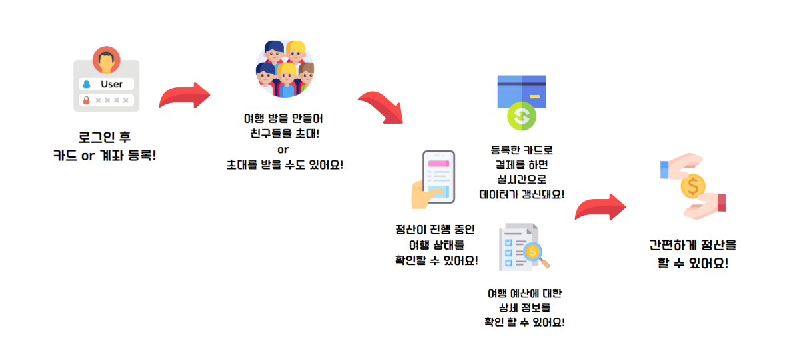

<br/>

---

<br/>

# 🔍2. 개발 환경

## 2-1. 환경설정

### 📱 **Android**


<br/>

### 💻 **Backend**


### ⚙ **CI/CD**


## 2-2. 서비스 아키텍쳐

### 📱 **Android**

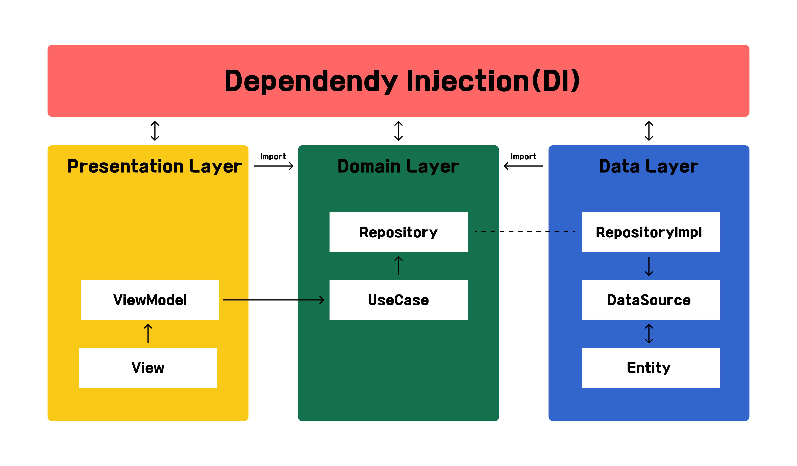

### 💻 **Backend**

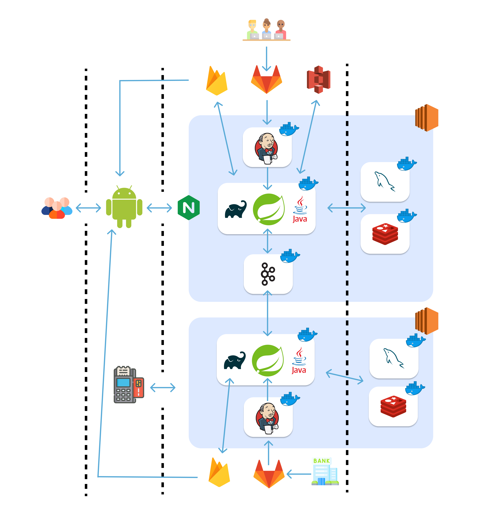

<br/>

---

<br/>

# 🔍 3. 주요 기능

### - 소셜 로그인

  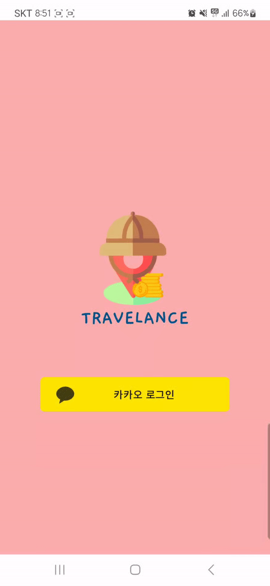

### - 1원 인증 👉 계좌 및 카드 등록

  


### - 여행 등록 및 친구 초대

  


### - 공지사항 등록

  


### - 현금결제 등록

  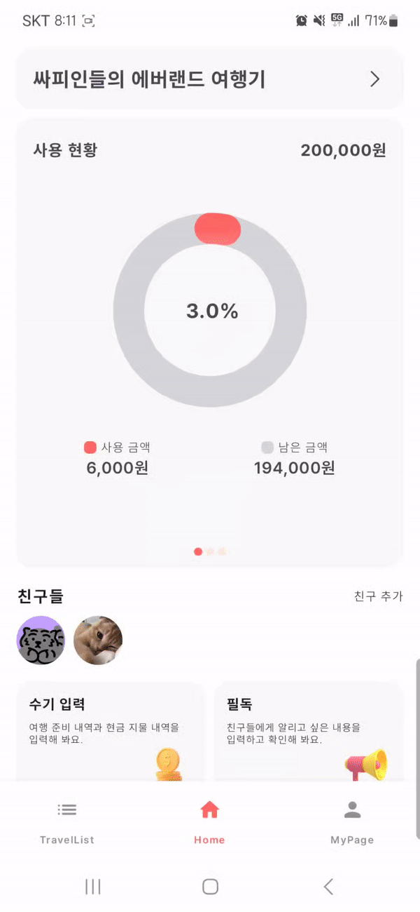


### - 카드사용 시 PUSH 알림

  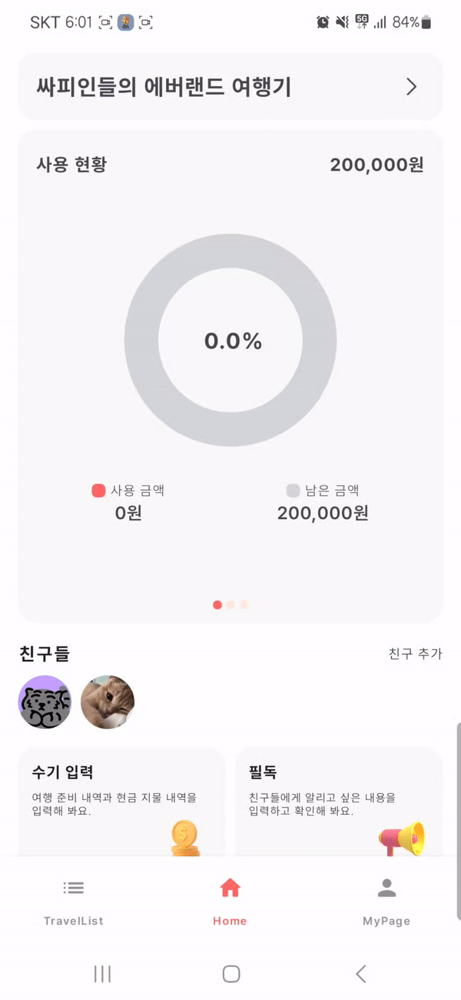

### - 공금 내역 제거

  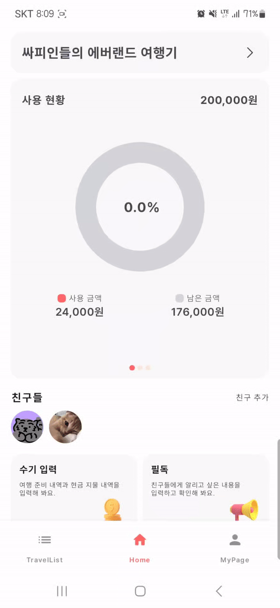

### - 개인 결제 공금에 추가

  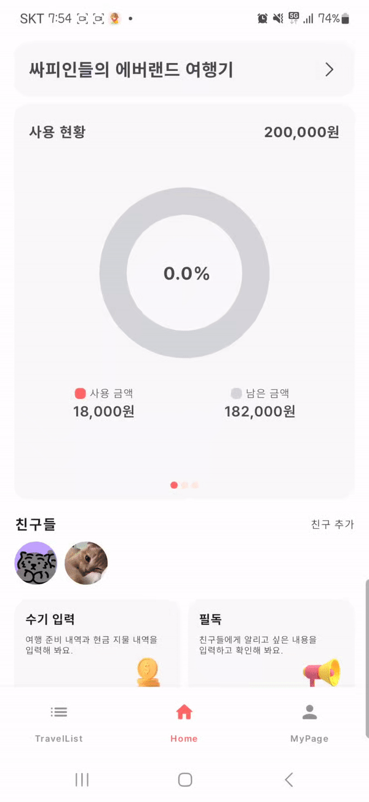

### - 정산

  

### - 발자취

  

### - 미니게임 (카드뽑기, 지목하기, 팀 정하기, 초성게임)

  

### - 홈 공금 내역 조회

  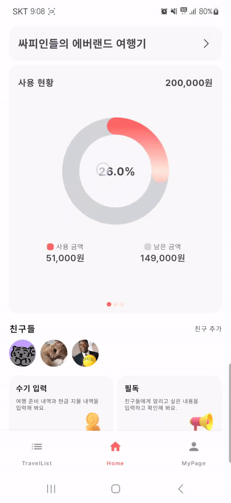

### - 마이페이지

  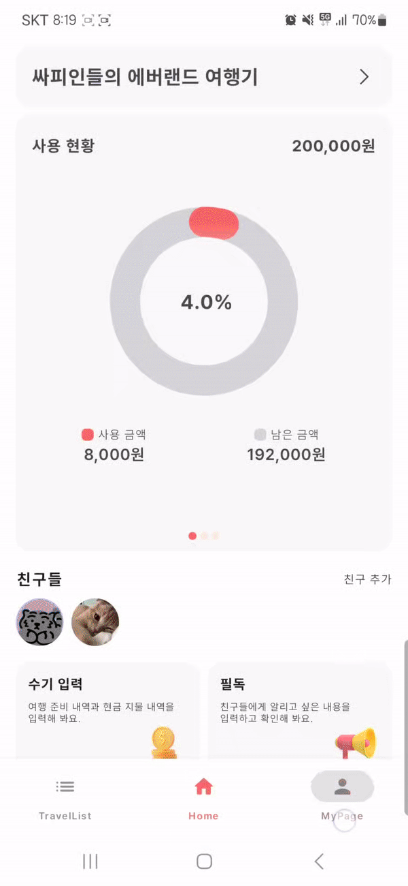

### - 여행 완료

  

<br/>

---

<br/>

# 🔍4. 프로젝트 산출물

## 4-1. ERD

- Business ERD
  

- Bank ERD
  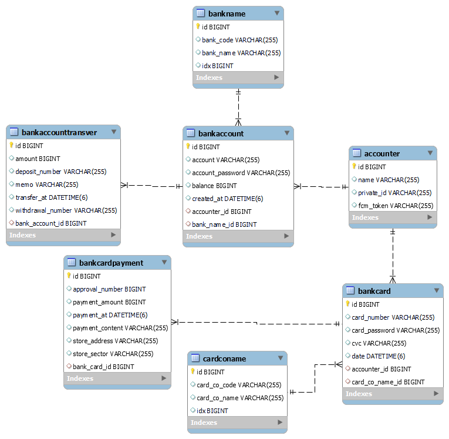

## 4-2. [Figma](https://www.figma.com/file/4LqAy6jaGjnOyNTY8JejZL/%EC%97%AC%ED%96%89-%EC%A0%95%EC%82%B0-%EC%95%B1?type=design&node-id=8-6&mode=design&t=zwAG1TJuxW4UqQOs-0)

## 4-3. [요구사항명세서](https://cord-custard-f85.notion.site/f68921e33061467c826b65dc215ab41b?pvs=4)

<br/>

---

<br/>

# 👩‍👦‍👦5. 팀 소개

| Android | Android | Android | Back end | Back end | Back end |
| :-----: | :-----: | :-----: | :------: | :------: | :------: |
| 차선호  | 하동혁  | 황신운  |  김제준  |  전수림  |  조혜진  |
